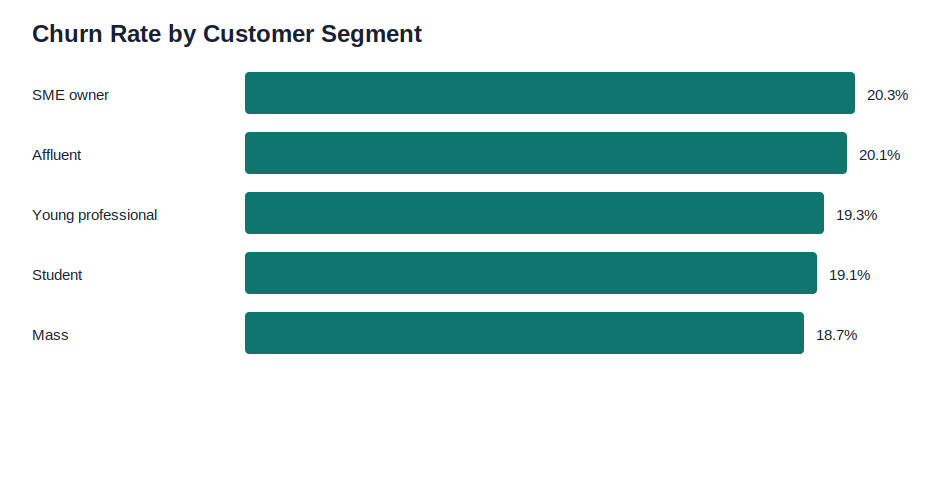
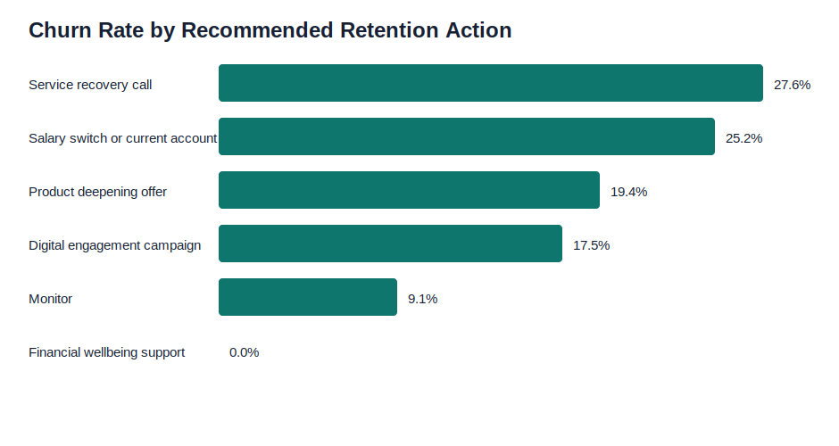

# Open Banking Customer Churn Analysis

Customer churn and retention analysis for a synthetic UK retail banking portfolio using open-banking-style activity data, explainable churn scoring, SQL cohort analysis, and dashboard-ready customer insight outputs.

## Business Problem

Retail banks need to identify customers likely to leave before balances, salary credits, product relationships, or card spend are lost. This project analyses customer activity, salary inflows, product holdings, digital engagement, complaints, overdraft usage, and balance movement to prioritise retention actions.

## Executive Summary

- Built a synthetic customer activity dataset with 3,500 retail banking customers.
- Created an explainable churn score using product depth, digital engagement, salary inflow behaviour, balance movement, complaints, overdraft usage, and tenure.
- Produced a priority retention queue and dashboard-ready KPI summaries.
- Added SQL queries, stakeholder summary, dashboard requirements, and retention recommendations.

## Key Results

| Churn Risk Band | Customers | Churn Rate | Average Balance | Value at Risk |
| --- | ---: | ---: | ---: | ---: |
| High churn risk | 158 | 44.9% | GBP1,139 | GBP84,418 |
| Medium churn risk | 1,041 | 28.0% | GBP1,286 | GBP326,701 |
| Low churn risk | 2,301 | 13.4% | GBP1,252 | GBP406,683 |

The churn scoring approach gives retention teams a clear queue: high-risk customers are more than three times as likely to churn as low-risk customers.

## Dashboard Preview





## Repository Structure

```text
data/
  raw/customer_monthly_features.csv
  processed/customers_churn_scored.csv
  processed/segment_churn_summary.csv
  processed/risk_band_summary.csv
  processed/retention_action_summary.csv
  processed/priority_retention_queue.csv
dashboard/
  screenshots/churn_rate_by_segment.svg
  screenshots/churn_rate_by_action.svg
docs/
  stakeholder_summary.md
  dashboard_requirements.md
  retention_recommendations.md
sql/
  churn_queries.sql
src/
  generate_sample_data.py
  build_churn_analysis.py
```

## Tools Used

- Python: pandas and numpy for synthetic data generation and churn scoring
- SQL: segment churn MI, high-value low-engagement customers, retention action MI, priority queue
- Dashboarding: Power BI/Tableau-ready KPI summaries and preview charts
- Business analysis: stakeholder summary, dashboard requirements, action recommendations

## Churn Scoring Logic

The score includes:

- One-product relationship
- Low digital logins
- Falling app engagement
- Missing or declining salary inflow
- Falling average balance
- Recent complaints
- High overdraft usage
- Tenure and product-depth stabilisers

Risk bands:

| Score | Churn Risk Band | Treatment |
| ---: | --- | --- |
| 45+ | High churn risk | Priority retention queue |
| 20 to 44 | Medium churn risk | Targeted campaign queue |
| 0 to 19 | Low churn risk | Monitor |

## Key Business Questions

- Which customers are most likely to churn?
- Which behavioural signals should trigger a retention action?
- Which customer segments show the highest churn rate?
- Which retention action should be prioritised by customer need?

## Business Recommendations

- Prioritise high churn risk customers with high balances or salary inflow deterioration.
- Use service recovery calls for customers with recent complaints.
- Offer salary-switch or current-account incentives where salary inflow has stopped or declined.
- Use product deepening offers for one-product customers.
- Track campaign outcomes with test/control measurement before scaling.

## How To Reproduce

```powershell
python src/generate_sample_data.py
python src/build_churn_analysis.py
```

If Python is not on PATH, run the scripts from any Python environment with `pandas` and `numpy` installed.

## Data Privacy

All data in this project is synthetic and created for portfolio demonstration only. It does not contain real customer, bank, or personally identifiable data.

## Suggested GitHub Topics

`uk-banking`, `customer-analytics`, `churn-analysis`, `python`, `sql`, `data-analysis`, `power-bi`, `business-analysis`
